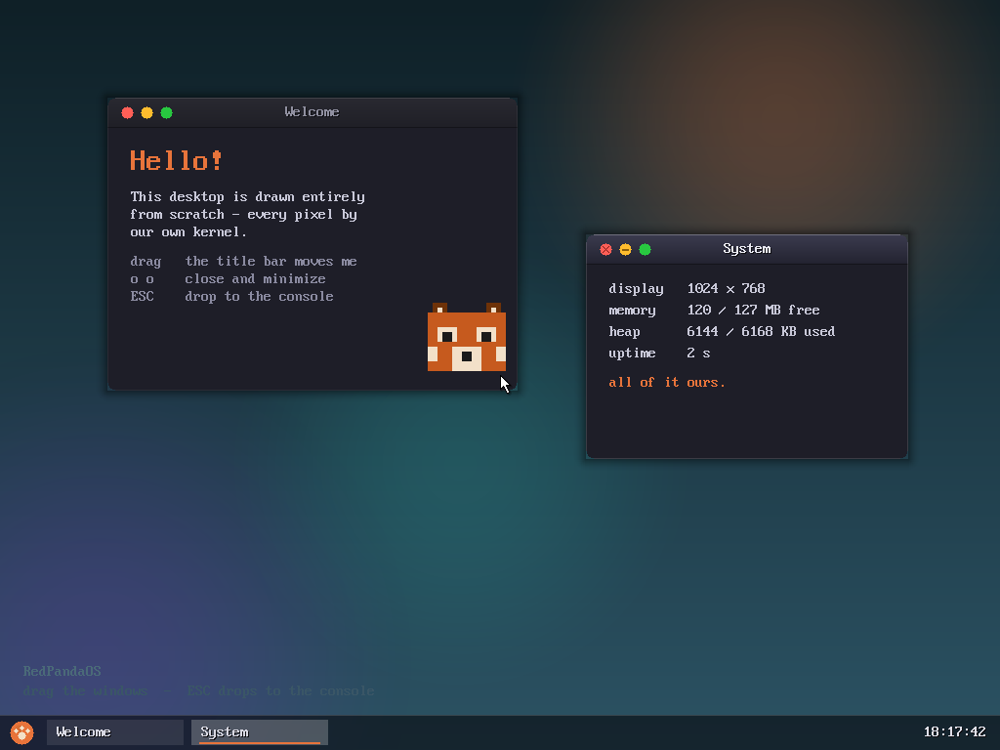
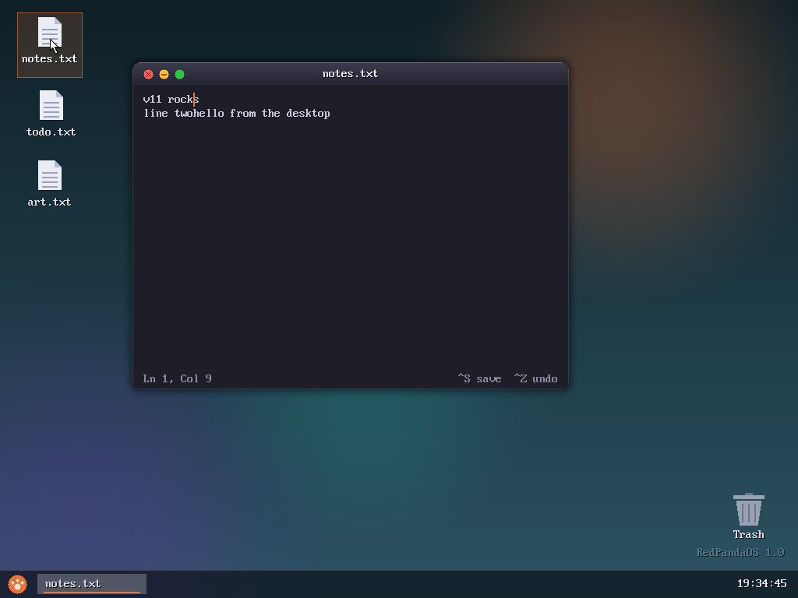
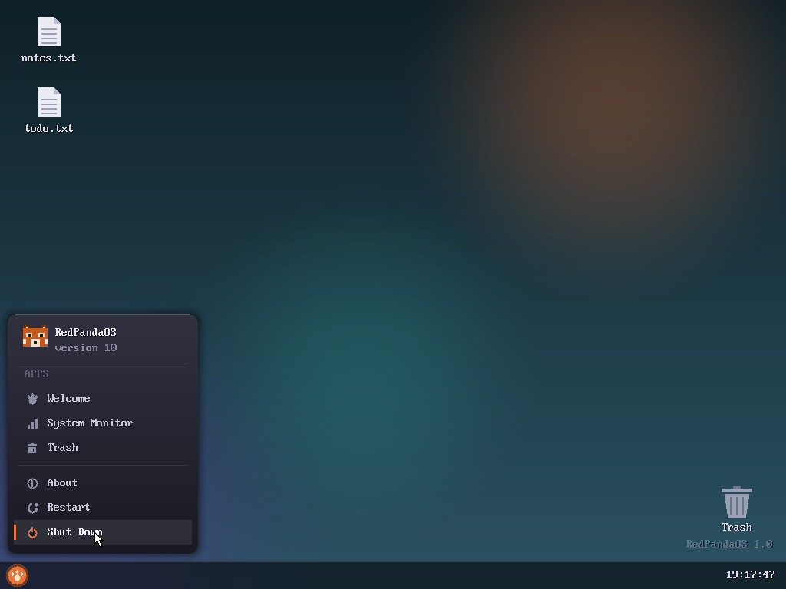
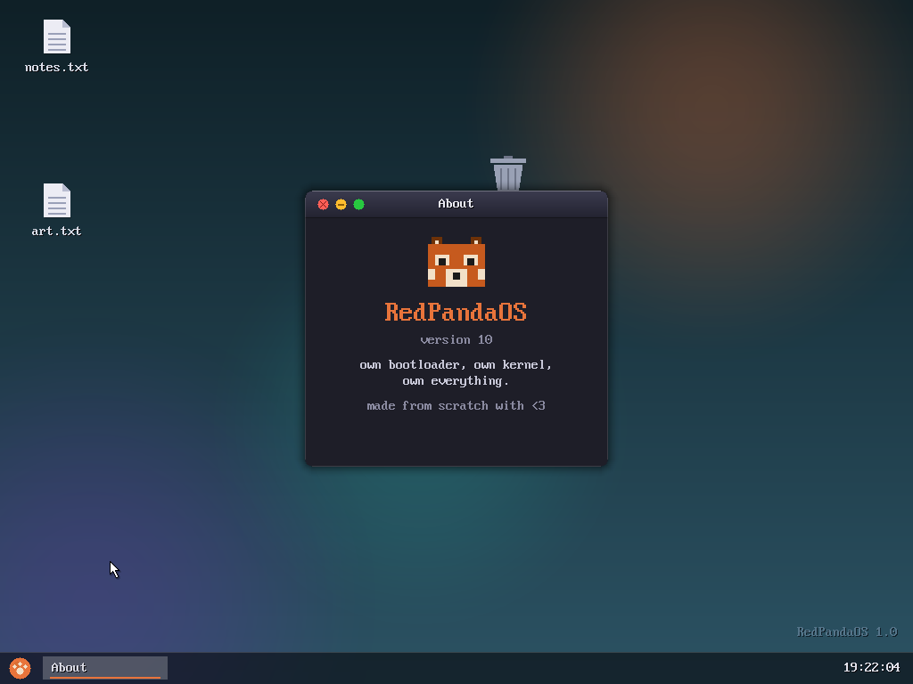
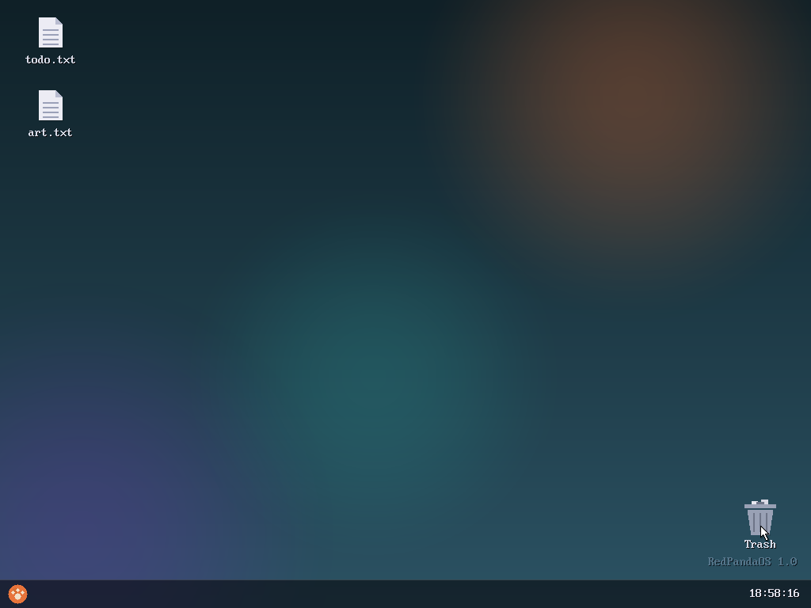
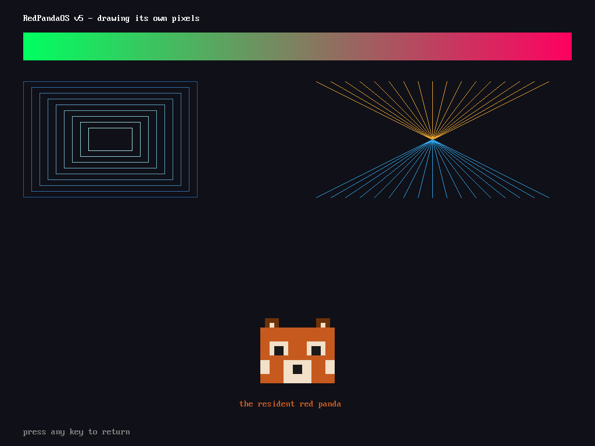
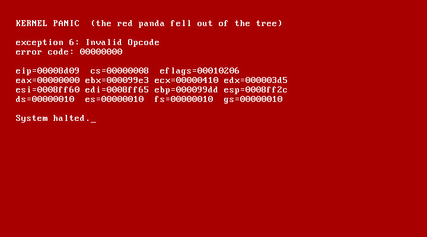

<div align="center">

# RedPandaOS 🐾

**A hobby operating system written completely from scratch.**

No libraries. No frameworks. Our own bootloader, our own kernel, our own
filesystem, our own GUI — *every single pixel* drawn by code we wrote ourselves.


</div>

---

RedPandaOS boots from a 512-byte sector we wrote, switches a bare-metal i686
CPU into protected mode, and brings up a complete graphical desktop — windows
with rounded corners and drop shadows, a start menu, draggable icons, a trash
bin, an on-disk filesystem, and a real text editor — all on top of a kernel
that has no operating system underneath it. There is no Linux here, no libc,
no GRUB. When RedPandaOS draws a window, it is setting individual pixels in a
framebuffer it negotiated from the BIOS by hand.

See [ROADMAP.md](ROADMAP.md) for the full journey, milestone by milestone.

## ✨ Gallery

<div align="center">

### The desktop — drawn entirely by our own kernel


### A real text editor — type, save (Ctrl+S), undo/redo (Ctrl+Z / Ctrl+Y)


</div>

<table>
<tr>
<td width="50%">

**Start menu** — slides out of the paw orb


</td>
<td width="50%">

**About** — own bootloader, own kernel, own everything


</td>
</tr>
<tr>
<td width="50%">

**Dynamic desktop** — icons & trash drop anywhere, persist on disk


</td>
<td width="50%">

**Graphics** — gradients, lines, and the resident red panda


</td>
</tr>
</table>

<div align="center">

*And when things go wrong — a themed kernel panic with a full register dump:*



</div>

## 🌟 What it does

RedPandaOS is currently at **v11 — the text editor**.

- 🖼️ **A full graphical desktop** — teal gradient wallpaper with soft glows,
  a frosted taskbar with a paw-print start orb, and a live RTC clock.
- 🪟 **A window manager & compositor** — draggable windows with rounded
  corners, hugging drop shadows, macOS-style traffic lights, z-order, focus,
  and minimize/restore — composited at the framebuffer level.
- 📝 **A real text editor** — typing, arrow keys, Home/End, click-to-place
  caret, scrolling, **Ctrl+S** to save, and **Ctrl+Z/Ctrl+Y** undo/redo (edit
  bursts coalesce, so undo takes back a word, not a letter).
- 🗂️ **A dynamic desktop** — every file is an icon; drag them (and the trash)
  anywhere and the layout persists on disk. Rubber-band selection,
  drag-to-trash, and a trash window to restore or empty.
- 🟧 **A start menu** — apps, About, Restart (8042 reset), and Shut Down (real
  ACPI poweroff).
- 💾 **Our own filesystem (RPFS)** — an ATA PIO disk driver plus a
  superblock + FAT-style block-chain format. Files survive reboots *and*
  rebuilds.
- 🖱️ **Mouse & keyboard** — PS/2 drivers with a unified input event queue,
  mouse acceleration, and a soft-shadowed arrow cursor.
- 🧠 **Memory management** — physical frame allocator, paging, and a kernel
  heap (`kmalloc`/`kfree`) with block splitting and coalescing.
- 🛠️ **A hidden developer console** (F12) — `ls`, `cat`, `write`, `rm`, and
  the older commands, for testing.

Everything above is built on a freestanding C kernel that we wrote every
function for — including `memcpy`, `printf`, and the font renderer.

## 🚀 Build & run

Requirements: [NASM](https://nasm.us), [LLVM/Clang](https://llvm.org)
(cross-compiles to bare-metal i686 out of the box), and
[QEMU](https://www.qemu.org).

```powershell
.\build.ps1          # build  ->  build\RedPandaOS.img
.\build.ps1 -Run     # build and boot in QEMU
```

That's it — a single PowerShell script assembles the boot sector, cross-compiles
the kernel, links it at `0x8000`, and stitches everything into a bootable
16 MB disk image (kernel + RPFS region).

## ⚙️ How a boot works

1. **`boot/boot.asm`** — the boot sector (512 B). The BIOS loads it to
   `0x7C00`. It sets up a stack, reads the kernel (64 sectors, LBA) from disk
   to `0x8000`, and jumps there. Frozen and finished — all evolution happens
   in the kernel.
2. **`kernel/entry.asm`** — the bridge out of the BIOS world: A20 → GDT →
   protected mode → zero BSS → `kmain()`.
3. **`kernel/kmain.c`** — initializes the IDT, PIC, timer, keyboard, enables
   interrupts, and starts the shell / desktop.

## 🗂️ Layout

```
boot/
  boot.asm        stage 1 bootloader (boot sector)
kernel/
  entry.asm       real mode -> protected mode entry stub
  kernel.ld       linker script (kernel linked at 0x8000)
  kmain.c         kernel entry point
  idt.c/.h        Interrupt Descriptor Table
  isr.asm         48 interrupt stubs + register save/restore
  isr.c/.h        exception panic screen, IRQ dispatch
  pic.c/.h        8259 PIC (IRQ remapping, EOI)
  timer.c/.h      PIT timer (100 Hz tick)
  keyboard.c/.h   PS/2 keyboard (scancodes -> ASCII, ring buffer)
  kprintf.c/.h    our own printf
  shell.c/.h      the redpanda> shell
  memmap.c/.h     BIOS E820 memory map reader
  pmm.c/.h        physical frame allocator (4 KB frames, bitmap)
  paging.c/.h     page directory/tables, identity mapping
  heap.c/.h       kernel heap: kmalloc/kfree at 0xD0000000
  videoinfo.h     VBE mode info left by the entry stub
  fb.c/.h         framebuffer: pixels, rects, lines, text, double buffer,
                  cursor compositing
  font.h          ROM 8x16 bitmap font access
  console.c/.h    text console rendered on the framebuffer
  mouse.c/.h      PS/2 mouse driver (IRQ12, packets, acceleration)
  cursor.c/.h     the arrow sprite (with soft drop shadow)
  input.c/.h      unified input event queue
  rtc.c/.h        CMOS real-time clock
  gui.c/.h        the desktop: compositor, window manager, taskbar
  ata.c/.h        ATA PIO disk driver (LBA28)
  fs.c/.h         RPFS - our own filesystem
  string.c/.h     our own memset/memcpy/strcmp/...
  io.h            port I/O (inb/outb)
tools/
  qmp-test.ps1    headless QEMU test: boot, type keys, screenshot
screenshots/      gallery images used in this README
build/            build output (generated, git-ignored)
build.ps1         build script
ROADMAP.md        the road to (and beyond) the GUI
```

## 🛣️ Where it's heading

Each version lands as its own self-contained, bootable milestone. v1 was
`Hello World` in 1024 bytes; v11 is a text editor on a graphical desktop.
Next up, eventually: **userspace (ring 3, syscalls), apps loaded from disk,
and much more.** The full milestone-by-milestone history lives in
[ROADMAP.md](ROADMAP.md).

## 📜 License

[MIT](LICENSE) — own bootloader, own kernel, own everything. Made from scratch
with ❤️.
